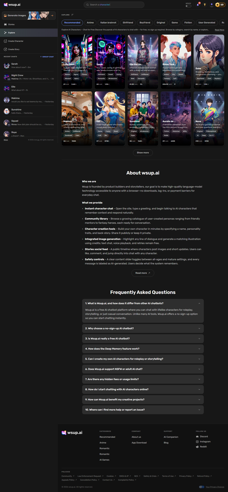
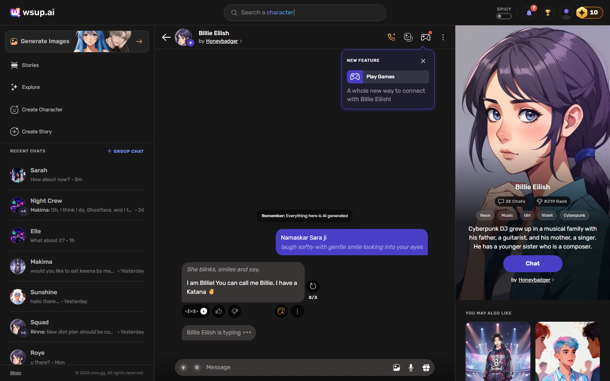
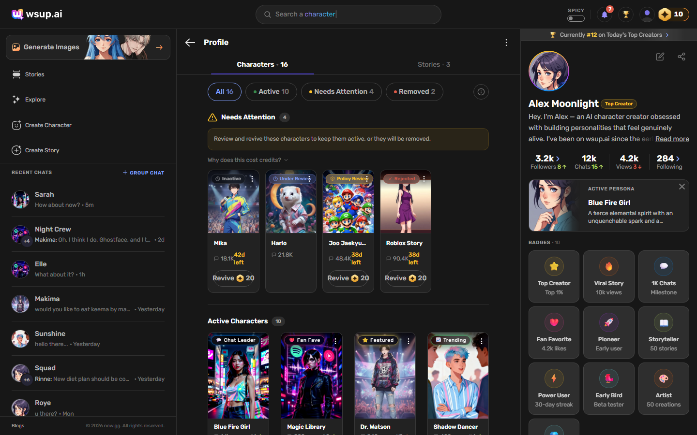
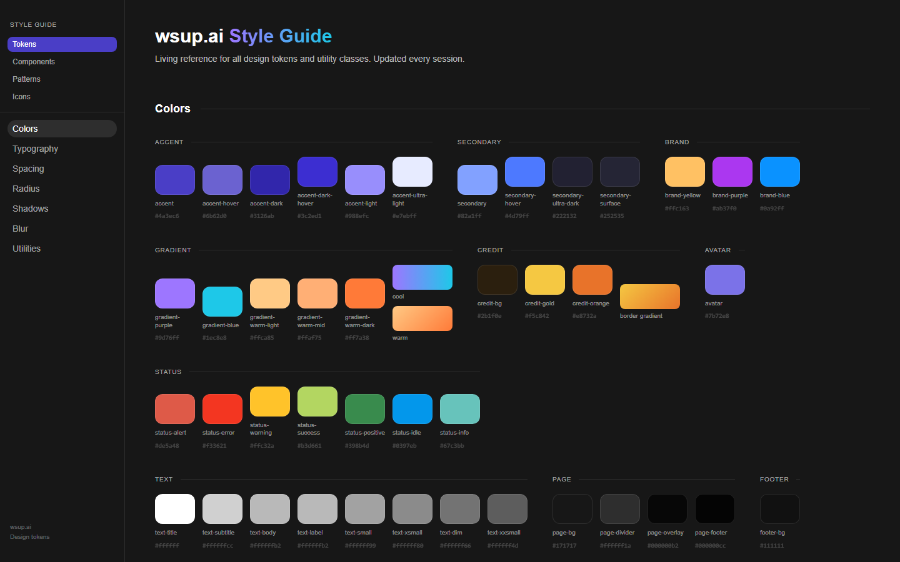

# wsup.ai — Screen Library & Design System

A production-grade UI screen library and living design system for [wsup.ai](https://wsup.ai), an AI character chat platform. Built with Next.js, React, TypeScript, and Tailwind CSS.

This isn't a Figma file — it's a **running, deployable reference** that serves as the single source of truth for design tokens, components, patterns, and screen layouts.



## What's Inside

### Screens
| Screen | Desktop | Mobile | Description |
|--------|---------|--------|-------------|
| **Explore** | ✅ | ✅ | Character discovery grid with category tabs, search, and filters |
| **Chat** | ✅ | ✅ | AI character conversation with sidebar, dormancy states, and coachmarks |
| **Profile** | ✅ | ✅ | User profile with character lifecycle dashboard, badges, stats |
| **Edit Character** | ✅ | — | Character creation and editing form |
| **Login** | ✅ | — | Authentication flow |
| **Email Templates** | ✅ | — | Dark-themed dormancy notification emails |
| **Style Guide** | ✅ | — | Living documentation with 4 tabs and 25+ sections |

### Design System

**62 custom components** across 5 categories — no external UI library dependencies.

| Category | Count | Examples |
|----------|-------|---------|
| UI Components | 16 | Button, BottomSheet, CenterPopup, Popover, FilterPills, CreditButton |
| Shared | 14 | Header, Sidebar, BottomNav, CharacterCard, SearchBar, Footer |
| Profile | 25 | ProfileHero, MyCharactersDashboard, BadgesWidget, RankBanner |
| Chat | 6 | ChatHeader, ChatMessages, ChatBar, DormancyBanner, Coachmark |
| Email | 1 | DormantEmailTemplate |

### Token System

Every visual property is tokenized — zero hardcoded values.

| Token Type | Count | Examples |
|------------|-------|---------|
| **Spacing** | 14 | `xxxs: 2px` → `6xl: 80px` |
| **Colors** | 90+ | Accent, secondary, status, text hierarchy (7 opacity levels) |
| **Radius** | 4 | `popup: 24px`, `card: 12px`, `button: 8px`, `pill: 9999px` |
| **Shadows** | 6 | small, normal, big, popup, button, dark |
| **Backdrop Blur** | 4 | `bg: 12px`, `medium: 32px`, `popup: 60px`, `heavy: 120px` |



## The AI Design Agent

This project is wired to a **designer agent** built in Claude Code that can generate new screens autonomously using the same tokens and components.

The agent reads 9 knowledge files containing:
- **134 design decisions** with reasoning
- **100+ taste corrections** from iterative review
- **70+ design rules** (spacing, typography, color hierarchy)
- **Project-specific patterns** (overlay architecture, component reuse, icon standards)

**Result:** Screen design time dropped from **4 hours to 20 minutes**.

The agent doesn't use screenshots or Figma — it designs from accumulated knowledge of how the designer thinks.

## Screenshots

**Explore**


**Chat**


**Profile**



**Style Guide**



## Tech Stack

- **Framework:** Next.js 14 (App Router)
- **Language:** TypeScript
- **Styling:** Tailwind CSS 3.4 with custom token config
- **Components:** 100% custom — no UI library (no shadcn, no MUI)
- **Fonts:** Custom (loaded via Next.js font optimization)
- **Deployment:** Vercel with PR preview branches

## Getting Started

```bash
# Clone
git clone https://github.com/arpityadav-bst/wsup-screen-library.git
cd wsup-screen-library

# Install
npm install

# Run
npm run dev
```

Open [http://localhost:3000](http://localhost:3000).

## Project Structure

```
src/
├── app/                    # Pages (Next.js App Router)
│   ├── explore/            # Character discovery
│   ├── chat/               # AI chat interface
│   ├── profile/            # User profile + character management
│   ├── edit-character/     # Character creation form
│   ├── login/              # Auth flow
│   ├── email/              # Email templates
│   └── style-guide/        # Living design documentation
├── components/
│   ├── ui/                 # Base components (Button, BottomSheet, etc.)
│   ├── shared/             # Cross-screen (Header, Sidebar, BottomNav)
│   ├── profile/            # Profile-specific components
│   ├── chat/               # Chat-specific components
│   └── email/              # Email templates
├── hooks/                  # Custom hooks (scrollbars, utilities)
├── lib/                    # Mock data, helpers
└── styles/
    └── globals.css         # CSS variables, animations, utilities
```

## Design Principles

- **Token-first:** Every color, spacing, radius, and shadow comes from the token system. Zero arbitrary values.
- **Mobile-first:** Designed at 414px, adapted to 1440px. Spacing inverts on desktop (slim → generous).
- **Component reuse:** Extract after 2 usages. Never rebuild what exists. Right sidebar reuses mobile components directly.
- **Consistency as UX:** Same role = same appearance. One `label-xs` class, one close button pattern, one icon system.

## Author

**Arpit Yadav** — AI-Native Product Designer
- [Portfolio](https://arpit.design)
- [LinkedIn](https://www.linkedin.com/in/arpityadav-ux/)
- arpit.uxdesign@gmail.com
